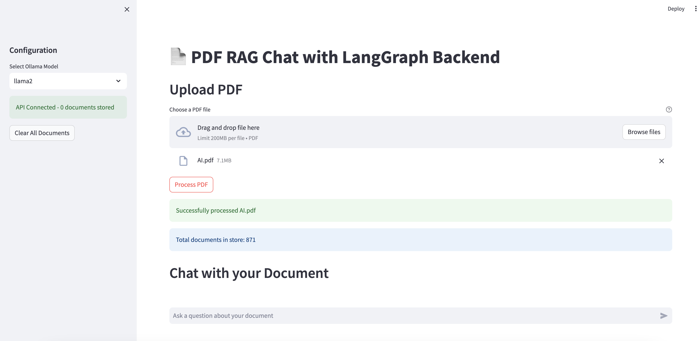

# RAG App using Ollama

A locally-running PDF question-answering system built with an agentic RAG pipeline. Upload a PDF, ask questions, and get answers grounded in the document — all running on your machine via Ollama (no cloud API required).

## Architecture

```
frontend/          (Streamlit)
    ↕ HTTP
backend/           (FastAPI)
    ↕
LangGraph Pipeline → Ollama (LLM + Embeddings) + FAISS (Vector Store) + SQLite (Memory)
```

### Backend (FastAPI + LangGraph)

- **FastAPI** — RESTful API server
- **LangGraph** — agentic pipeline with conditional routing and retry loops
- **FAISS** — in-memory vector store for document embeddings
- **Ollama** — local LLM (llama2 / mistral / codellama) and `nomic-embed-text` embeddings
- **SQLite** — persistent conversation memory via LangGraph's `SqliteSaver`

### Frontend (Streamlit)

- **Chat page** — PDF upload, model selector, multi-session chat with source viewing
- **Dashboard page** — live pipeline metrics, agent call counts, retry rates, and color-coded execution logs



## Agentic Pipeline

Queries run through a 5-node LangGraph graph with dynamic routing and self-correction:

```
Router → Retrieve → Relevance Grader ⟳(retry) → Generator → Hallucination Grader ⟳(regenerate) → END
         ↘ (general query) ↗
```

| Node | Role |
|---|---|
| **Router** | Classifies the query: needs document retrieval or can answer directly |
| **Retrieve** | Fetches top-4 chunks from FAISS using semantic similarity |
| **Relevance Grader** | Filters out chunks not relevant to the query; retries retrieval if none pass |
| **Generator** | Produces an answer using the filtered context |
| **Hallucination Grader** | Verifies the answer is grounded in retrieved docs; triggers regeneration if not |

## Features

- PDF document upload and processing
- Semantic search with vector embeddings
- Multi-session chat with persistent conversation history (SQLite)
- Agentic self-correction — relevance grading and hallucination checking with automatic retries
- Support for multiple Ollama models (llama2, mistral, codellama)
- Live dashboard with pipeline metrics and agent execution logs
- Fully local — no external API calls

## Setup

### Prerequisites

1. **Ollama** — install and pull a model:

   ```bash
   curl -fsSL https://ollama.ai/install.sh | sh
   ollama serve

   ollama pull llama2
   ollama pull nomic-embed-text   # required for embeddings
   ```

2. **Python 3.9+**

### Installation

```bash
# Backend
cd backend
pip install -r requirements.txt

# Frontend
cd frontend
pip install -r requirements.txt
```

## Running

### 1. Start the Backend

```bash
cd backend
python main.py
# API available at http://localhost:8000
```

### 2. Start the Frontend

```bash
cd frontend
streamlit run app.py
# UI available at http://localhost:8501
```

## API Endpoints

| Method | Endpoint | Description |
|---|---|---|
| `GET` | `/` | Health check |
| `POST` | `/upload` | Upload and process a PDF |
| `POST` | `/chat` | Send a message |
| `GET` | `/documents` | Get document store info |
| `DELETE` | `/documents` | Clear all documents |
| `GET` | `/stats` | Get pipeline metrics (used by dashboard) |

### Examples

```bash
# Upload a PDF
curl -X POST "http://localhost:8000/upload" \
  -F "file=@document.pdf"

# Chat
curl -X POST "http://localhost:8000/chat" \
  -H "Content-Type: application/json" \
  -d '{"message": "What is this document about?", "model": "llama2"}'
```

## Configuration

### Environment Variables

| Variable | Default | Description |
|---|---|---|
| `OLLAMA_HOST` | `http://localhost:11434` | Ollama server URL (backend) |
| `API_BASE_URL` | `http://localhost:8000` | Backend URL (frontend) |

### Default Settings

- Embedding model: `nomic-embed-text`
- Chunk size: 1000 characters, 200-character overlap
- Retrieval top-k: 4 chunks
- Default LLM: `llama2`

## Project Structure

```
├── backend/
│   ├── main.py                    # FastAPI app and route definitions
│   ├── stats.py                   # In-memory pipeline metrics tracker
│   ├── services/
│   │   ├── rag_workflow.py        # LangGraph agentic pipeline
│   │   ├── pdf_service.py         # PDF parsing and chunking
│   │   ├── vector_service.py      # FAISS vector store wrapper
│   │   └── ollama_service.py      # Ollama LLM and embedding client
│   ├── evaluation/
│   │   ├── evaluate.py            # RAGAS evaluation runner
│   │   └── evaluation_dataset.py  # Test dataset
│   └── requirements.txt
├── frontend/
│   ├── app.py                     # Chat page (Streamlit)
│   ├── pages/
│   │   └── 1_Dashboard.py         # Live pipeline dashboard
│   ├── api_client.py              # HTTP client for backend
│   └── requirements.txt
├── docker-compose.yml
└── README.md
```

## Docker

```bash
docker-compose up --build
```

## Troubleshooting

- **Ollama not connecting** — ensure `ollama serve` is running on port 11434
- **Model not found** — run `ollama pull <model-name>` before starting the backend
- **API connection error in UI** — ensure the backend is running on port 8000
- **CORS issues** — backend includes CORS middleware; check `API_BASE_URL` env var
